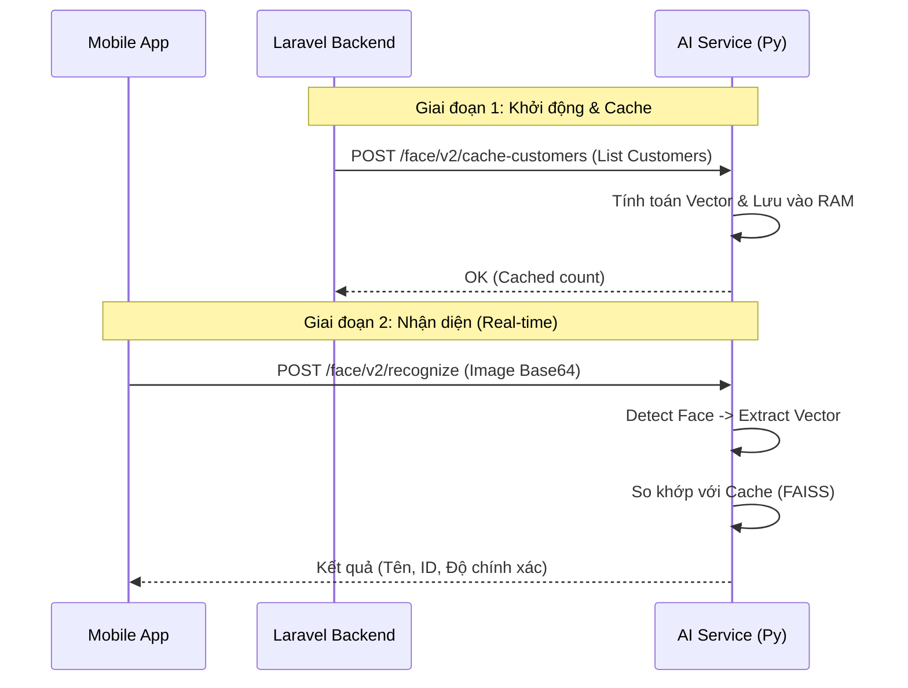

# 🧠 AI Service Documentation

Tài liệu tích hợp **AI Service** dành cho đội ngũ Backend/Mobile.
Hệ thống cung cấp 2 tính năng chính: **Nhận diện khuôn mặt (FaceID)** và **Gợi ý món ăn theo thời tiết (Smart Recommend)**.

---

## 🛠️ Tech Stack & Yêu cầu
- **Core**: Python 3.10+, FastAPI, Uvicorn.
- **AI Models**: 
    - Face: ArcFace (InsightFace) + FAISS (Vector Search).
    - Temperature: Scikit-learn (SVM/RandomForest).
- **Port mặc định**: `9009`

---

## �️ Luồng Hoạt Động (Workflow)



## �🚀 Quick Start

### 1. Cài đặt môi trường
Đảm bảo đã cài `python` và `pip`.

```bash
# 1. Cài thư viện (Chỉ chạy 1 lần)
pip install -r requirements.txt

# 2. Khởi động Server (Tắt reload để tránh lỗi Windows)
python main.py
```

### 2. Kiểm tra hoạt động
 Truy cập Swagger UI để xem tài liệu API chi tiết: [http://127.0.0.1:9009/docs](http://127.0.0.1:9009/docs)

---

## 👤 Module 1: Face Recognition (FaceID)

Hệ thống hỗ trợ 2 chế độ nhận diện:

1.  **Stateful Recognition (Khuyên dùng)**: Cache dữ liệu trước, nhận diện siêu nhanh.
2.  **Stateless Recognition (Test/New User)**: Gửi thông tin khách kèm request nhận diện.

### 1. 📥 Cache Dữ liệu Khách hàng (`/face/v2/cache-customers`)
**Mục đích**: Đồng bộ dữ liệu khách hàng từ DB sang RAM của AI để nhận diện nhanh.
**Thời điểm gọi**: Khi khởi động Backend hoặc có khách hàng mới đăng ký.

- **Method**: `POST`
- **Body**:
  ```json
  {
    "customers": [
      {
        "id": 101,
        "name": "Nguyen Van A",
        "avatar_url": "https://domain.com/storage/avatars/user1.jpg", 
        "avatar_path": "/uploads/avatars/user1.jpg" 
      }
    ]
  }
  ```
  *(Ưu tiên `avatar_path` local nếu cùng server, nếu không dùng `avatar_url`)*

- **Response**:
  ```json
  {
    "ok": true,
    "message": "Đã cache 150 customers cho V2",
    "cached": 150
  }
  ```

### 2. 🔍 Nhận diện Khuôn mặt (`/face/v2/recognize`)
**Mục đích**: Gửi ảnh từ Camera/App để tìm danh tính khách hàng.

- **Method**: `POST`
- **Body**:
  ```json
  {
    "image_base64": "data:image/jpeg;base64,/9j/4AAQSw...", // Ảnh chụp từ camera
    "customers": [] // (Optional) ONLY FOR TESTING/NEW USERS. Gửi kèm thông tin khách để nhận diện ngay mà không cần gọi API Cache trước.
  }
  ```

- **Response (Có người quen)**:
  ```json
  {
    "success": true,
    "matched": true,
    "customer_id": 101,
    "customer_name": "Nguyen Van A",
    "confidence": 98.5,        // Độ tin cậy (0-100%)
    "is_suspected": false,     // false = Chắc chắn, true = Nghi ngờ (cần xác nhận lại)
    "similarity": 0.85
  }
  ```

- **Response (Người lạ)**:
  ```json
  {
    "success": true,
    "matched": false,
    "message": "Không tìm thấy khách hàng phù hợp"
  }
  ```

---

## 🌤️ Module 2: Weather Recommendation (Gợi ý món)

Cơ chế: **Hybrid (Rule + AI)**. AI tự học từ tên món (Rule) hoặc lịch sử (AI Model) để biết món nào Nóng/Lạnh.

### 1. 📥 Cache Menu (`/temperature/cache-menu`)
**Mục đích**: Gửi toàn bộ Menu sang AI để phân loại Nóng/Lạnh sẵn.
**Thời điểm gọi**: Khi khởi động Backend hoặc cập nhật Menu.

- **Method**: `POST`
- **Body**:
  ```json
  {
    "items": [
      { "id": 1, "name": "Cà phê sữa đá", "categoryName": "Cà phê" },
      { "id": 2, "name": "Trà gừng nóng", "categoryName": "Trà" }
    ]
  }
  ```

- **Response**:
  ```json
  {
    "ok": true,
    "cached_count": 50,
    "message": "Cached 50 menu items"
  }
  ```

### 2. 💡 Lấy Gợi ý theo Nhiệt độ (`/temperature/recommend`)
**Mục đích**: Lấy danh sách món phù hợp với thời tiết hiện tại.

- **Method**: `POST`
- **Body**:
  ```json
  {
    "temperature": 35.5,  // Nhiệt độ hiện tại (lấy từ Weather API)
    "threshold": 30.0     // Ngưỡng nóng (Mặc định 30). T > 30 => Gợi ý đồ lạnh.
  }
  ```

- **Response**:
  ```json
  [
    {
      "id": 1,
      "name": "Cà phê sữa đá",
      "temperature": "COLD",
      "reason": "Weather 35.5°C >= Threshold 30.0°C"
    }
  ]
  ```

---

## ❓ Troubleshooting (Sửa lỗi thường gặp)

| Lỗi | Nguyên nhân | Cách xử lý |
|---|---|---|
| `Face Recognition V2 chưa sẵn sàng` | Model đang tải ngầm (Lazy Load). | Gọi API cache lại hoặc gọi API recognize 1 lần để kích hoạt model. |
| `[Errno 10048] address already in use` | Port 9009 đang bị chiếm. | Tắt terminal cũ hoặc chạy `taskkill /F /IM python.exe`. |
| `ModuleNotFoundError` | Thiếu thư viện. | Chạy lại `pip install -r requirements.txt`. |
| `OpenCV/DLL Load Failed` | Thiếu Visual C++. | Cài đặt **Visual C++ Redistributable** cho Windows. |

---

> **Lưu ý cho Backend**: 
> 1. Luôn gọi API **Cache** (`/face/v2/cache-customers` và `/temperature/cache-menu`) khi khởi động hệ thống để AI có dữ liệu mới nhất.
> 2. Ảnh Base64 gửi lên nên nén nhẹ (< 500KB) để tắng tốc độ xử lý.
